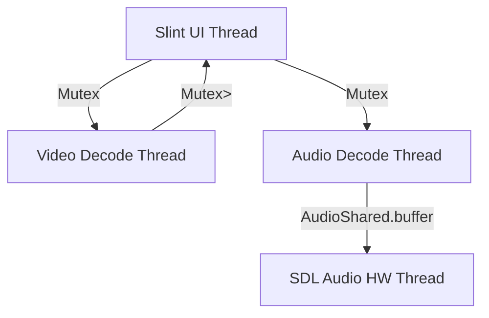

# ohhPlayer 🎬

<div align="center">
  
  
  
  
</div>

<br>

**ohhPlayer** is a minimal, blazing-fast, and production-quality video player written entirely in Rust. 

It leverages the power of **FFmpeg** for robust hardware/software media decoding, **SDL2** for low-latency audio playback, and **Slint** for a beautiful, declarative, and modern user interface.

## ✨ Features

- **Modern Glassmorphic UI**: Floating control bars, animated OSD overlays, and sleek popup menus.
- **Auto-Scaling Window**: The player automatically detects video aspect ratios and snaps the window to fit perfectly.
- **Smart Resume**: Automatically remembers where you left off. Re-opening a video resumes playback from your last position seamlessly.
- **Persistent Preferences**: Volume, playback speed, scale mode, and window pinning are automatically saved to `~/.ohhplayer_settings`.
- **Sleep Timer**: Set an auto-shutdown timer (15, 30, 45, or 60 minutes) straight from the UI.
- **Recent Files Menu**: Quickly jump back into the last 15 videos you watched via the hamburger menu.
- **Always-on-Top Pinning**: Pin the player above all other windows for easy multitasking.
- **Dynamic Scale Modes**: Switch effortlessly between Fit, Stretch, Zoom, 100%, 1:1, 16:9, and 9:16.
- **Comprehensive Hotkeys**: Instant keyboard control over every aspect of playback (press `?` in-app for the cheat sheet).

## 🏗 Architecture

ohhPlayer is designed with a strict multi-threaded architecture to ensure the UI remains buttery smooth at 60 FPS while heavy decoding happens in the background.

| Layer | Technology | Purpose |
|---|---|---|
| **UI** | [Slint](https://slint.dev) (`.slint` files) | Declarative UI, controls, animations, overlays |
| **Video Decode** | FFmpeg (`ffmpeg-sys-next`) | Demux, decode, scale to RGB |
| **Audio Decode** | FFmpeg + SDL2 | Demux, decode, resample to 44100 Hz f32 |
| **Audio Playback** | SDL2 (`sdl2` crate) | Push-mode audio callback |
| **Glue / State** | Rust `main.rs` & `app.rs` | Wires UI callbacks ↔ decoder/audio threads |



## ⌨️ Keyboard Shortcuts

| Key | Action |
|---|---|
| `Space` | Play / Pause |
| `f` / `F` | Toggle fullscreen |
| `j` | Seek −10 seconds |
| `l` | Seek +10 seconds |
| `,` | Seek −5 seconds |
| `.` | Seek +5 seconds |
| `Up` / `Down` | Adjust Volume ±5% |
| `m` / `M` | Mute / Unmute |
| `?` / `h` / `H` | Toggle Keyboard Shortcuts Help |
| `Escape` / `q`| Close Player |

## 🚀 Getting Started

### Prerequisites

Ensure you have the required system dependencies installed on your Linux machine:

```bash
# Ubuntu/Debian
sudo apt update
sudo apt install libavcodec-dev libavformat-dev libswscale-dev libswresample-dev libsdl2-dev clang pkg-config
```

### Build & Run

```bash
# Clone the repository
git clone https://github.com/GrandpaEJ/ohhPlayer.git
cd ohhPlayer

# Build and run the app (without a file)
cargo run --release

# Run with a specific video file
cargo run --release -- path/to/video.mp4
```

*Note: For the best performance and frame-pacing, it is highly recommended to run ohhPlayer in `--release` mode.*

## 📂 File Structure

```text
ohhPlayer/
├── src/
│   ├── main.rs        # Entry point and initialization
│   ├── app.rs         # Slint callbacks, timers, window scaling, settings logic
│   ├── decoder/       # Video decoding thread, frame-pacing, seek handling
│   ├── audio/         # Audio decoding thread, SDL playback loop
│   ├── settings.rs    # Persistent JSON settings & play history manager
│   └── ui_state.rs    # Opacity/animation helpers, time formatting
├── ui/
│   ├── appwindow.slint      # Root window, property routing, overlays
│   ├── controls.slint       # Bottom controls bar (seek, volume, speed)
│   ├── top-menu.slint       # Hamburger menu & dropdown
│   ├── recent-files.slint   # Recent files list UI
│   ├── osd.slint            # On-Screen Display overlay
│   └── keyboard-help.slint  # Keyboard shortcuts popup
├── build.rs           # Slint build script
└── Cargo.toml         # Rust dependencies
```

## 📜 Contributing

If you'd like to contribute, please read the [AGENTS.md](AGENTS.md) file first. It acts as the source of truth for our architecture, threading rules, lock management conventions, and Slint design limitations.

Use **Conventional Commits** for all pull requests.

## 📄 License

This project is licensed under the MIT License.
